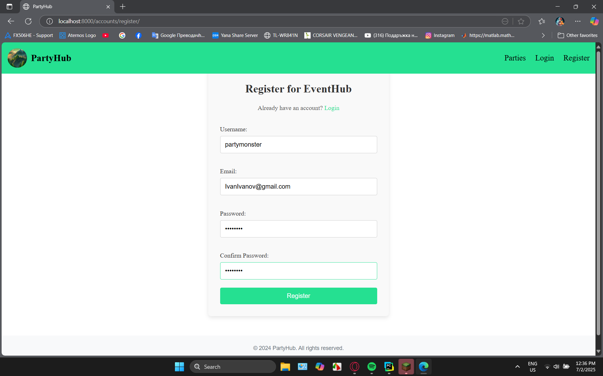
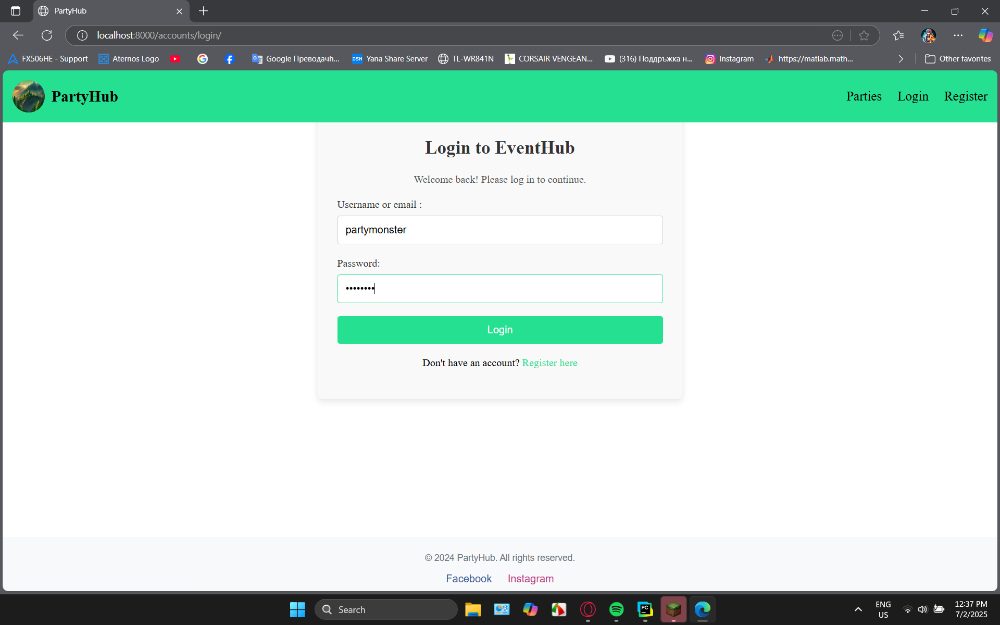
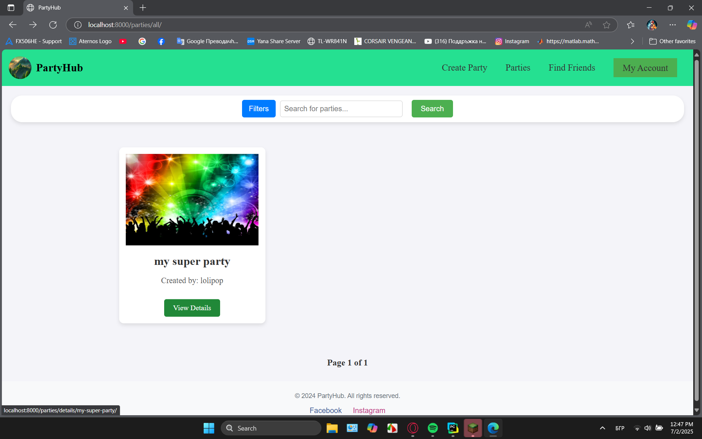
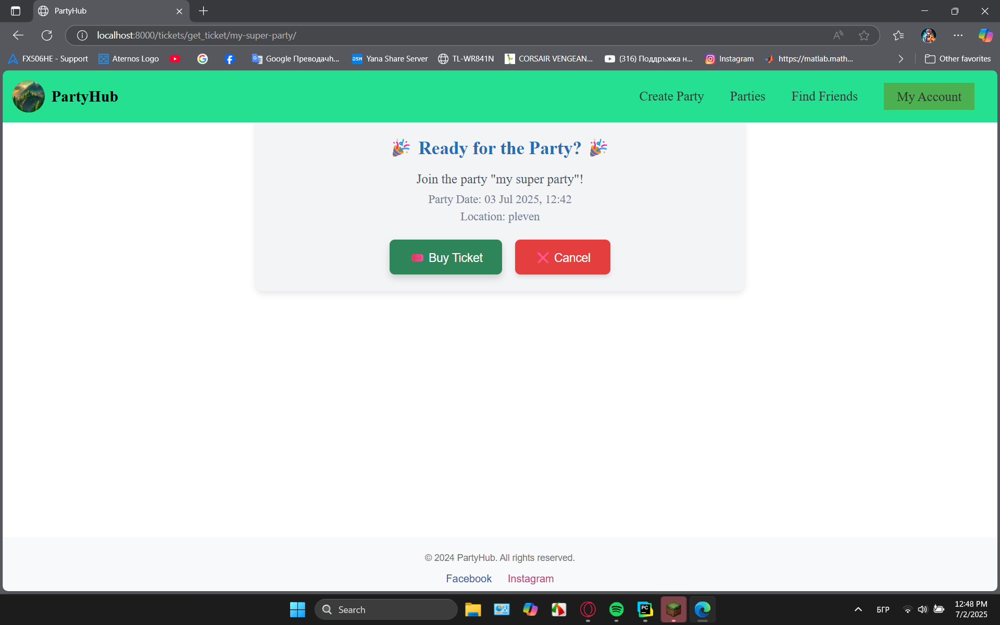
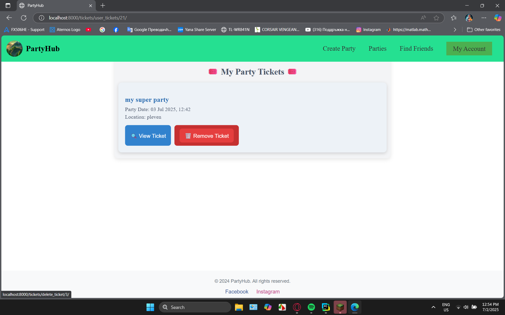
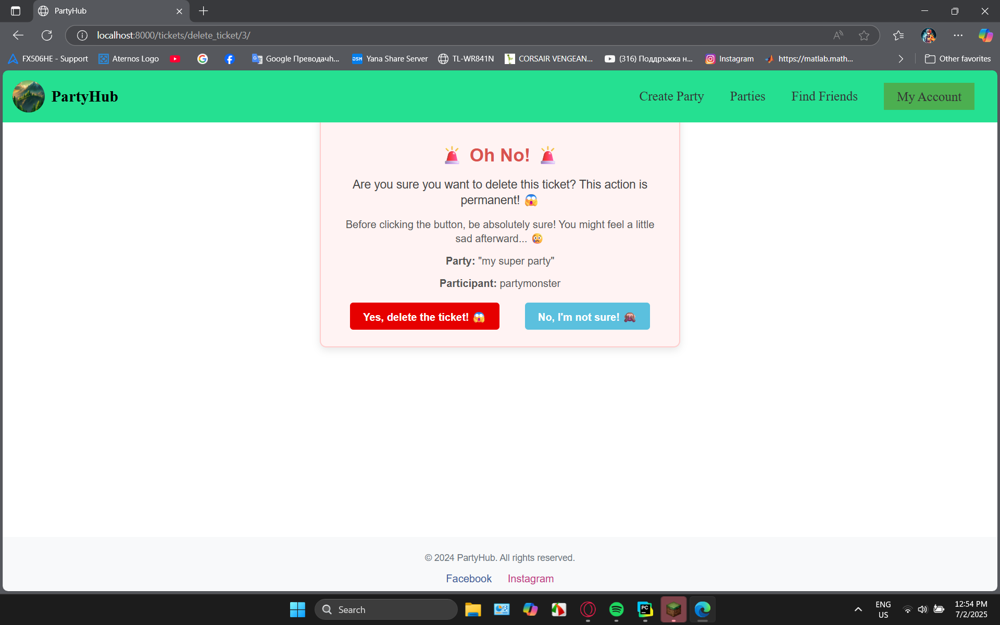
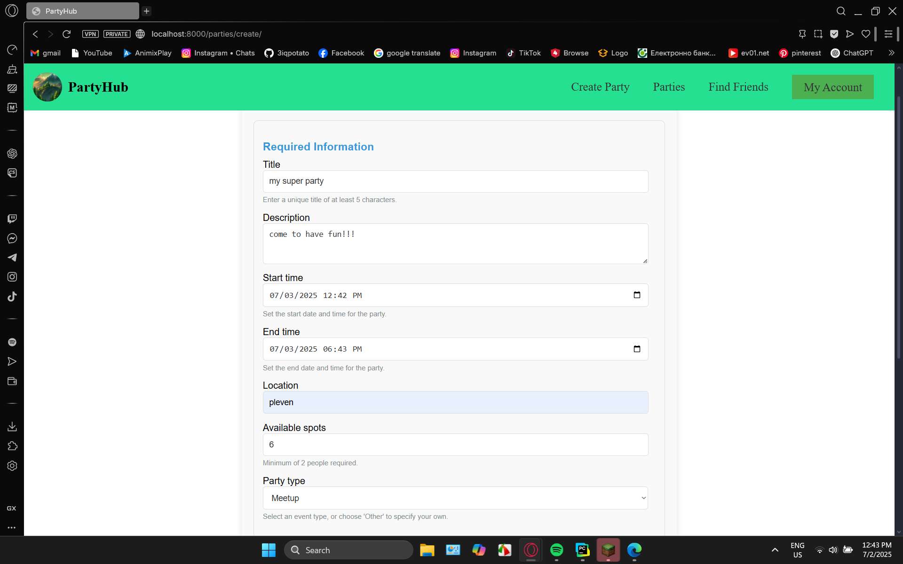
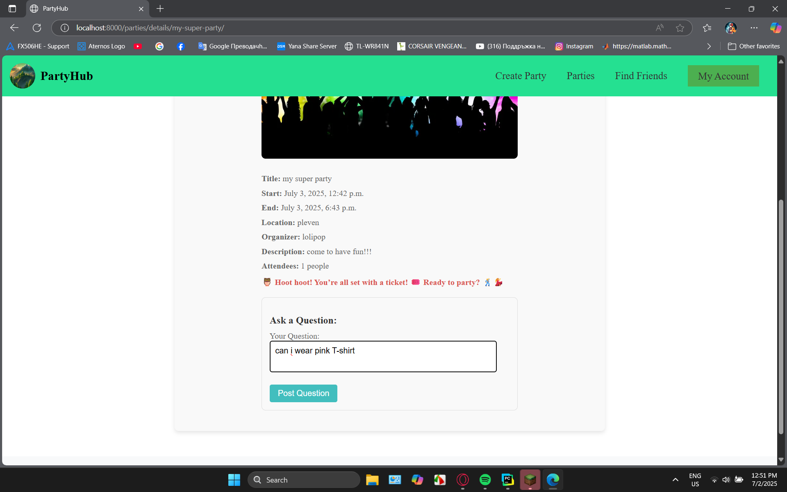
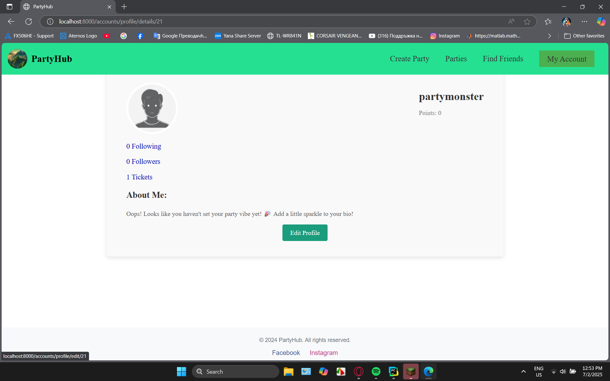
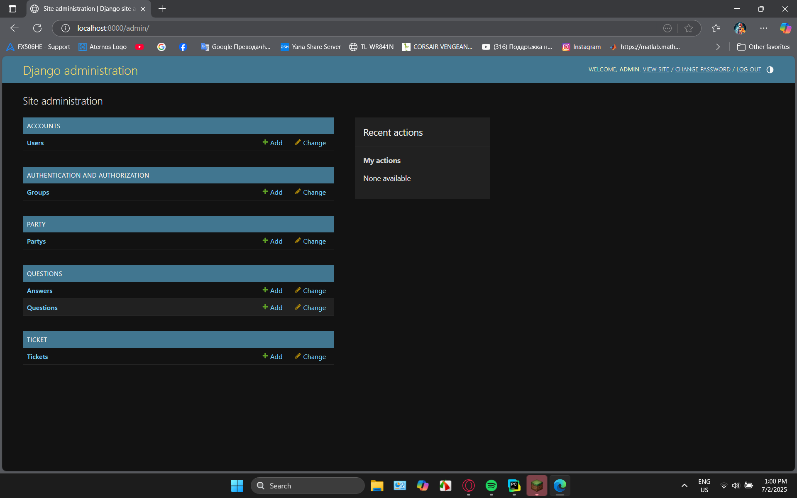

# 🎉 PartyHub – Потребителски функционалности

Тази документация показва как работят основните функции в PartyHub: регистрация, логване, създаване и участие в събития, коментари и други. Всяка функция е показана с примери и (ако е налично) скрийншоти.

---

## 🔐 1. Регистрация на потребител

- Полета: име, имейл, парола, потвърждение на паролата
- Валидации: уникален имейл, силна парола

**Пример:**


---

## 🔑 2. Вход (логване)

- Изисква: имейл и парола
- Ако данните са грешни: показва се съобщение за грешка

**Пример:**


---

## 🎫 3. Присъединяване към събитие (купуване на билет)

- Всеки потребител може да се запише за събитие, ако има свободни места
- При успешно записване се изпраща потвърждение

**Пример:**



---

## ❌ 4. Отказване от събитие

- Потребителят може да се откаже от записано събитие
- Мястото става свободно за други
- Става като изтрием билета за партито

**Пример:**



---

## 🗓️ 5. Създаване на събитие

- Само регистрирани потребители могат да създават събития
- Полета: заглавие, дата, локация, описание, капацитет

**Пример:**


---

## 💬 6. Коментиране под събитие

- Всеки записан потребител може да остави коментар
- Коментарите се показват под събитието

**Пример:**


---

## 👤 7. Профил и табло на потребителя

- Виждане на:
  - Създадени събития
  - Събития, за които е записан
  - последователи
  - следвани хора
  - точки

**Пример:**


---


## ⚙️ 8. Админ панел (ако има)

- можем да виждамме всички участници техните партита, билети и цялата публична информация

**Пример:**

---

## 🧪 Тестове на тези функции

- Автоматични тестове има за:
  - Регистрация и логване
  - Създаване на събитие
  - Записване и отписване от събитие
  - Коментари

```bash
python manage.py test
